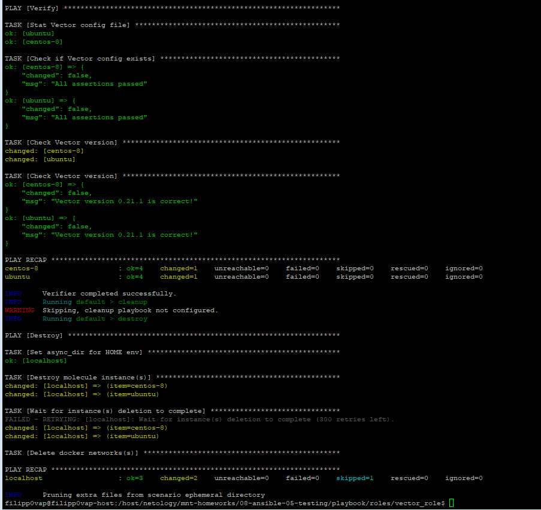
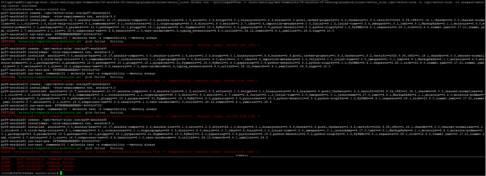

# Домашнее задание к занятию "08.05 Тестирование Roles"

## Подготовка к выполнению
1. Установите molecule: `pip3 install "molecule==3.5.2"`
2. Выполните `docker pull aragast/netology:latest` -  это образ с podman, tox и несколькими пайтонами (3.7 и 3.9) внутри

## Основная часть

Наша основная цель - настроить тестирование наших ролей. Задача: сделать сценарии тестирования для vector. Ожидаемый результат: все сценарии успешно проходят тестирование ролей.

### Molecule

1. Запустите  `molecule test -s centos8` внутри корневой директории clickhouse-role, посмотрите на вывод команды.
2. Перейдите в каталог с ролью vector-role и создайте сценарий тестирования по умолчанию при помощи `molecule init scenario --driver-name docker`.
3. Добавьте несколько разных дистрибутивов (centos:8, ubuntu:latest) для инстансов и протестируйте роль, исправьте найденные ошибки, если они есть.
4. Добавьте несколько assert'ов в verify.yml файл для  проверки работоспособности vector-role (проверка, что конфиг валидный, проверка успешности запуска, etc). Запустите тестирование роли повторно и проверьте, что оно прошло успешно.
5. Добавьте новый тег на коммит с рабочим сценарием в соответствии с семантическим версионированием.

## Ответы
1. 
```bash
filipp0vap@filipp0vap-host:/host/netology/ansible-roles/clickhouse-role$ molecule test -s centos8
CRITICAL 'molecule/centos8/molecule.yml' glob failed.  Exiting.
```
2. [molucule_folder](./playbook/roles/vector_role/molecule/)

3. Собрал образы Centos 8 и Ubuntu latest с предустановленным питоном

[Dockerfile.ubuntu](./Dockerfile.ubuntu)

[Dockerfile.centos8](./Dockerfile.centos8)

Пофиксил все ошибки и добился что тест проходит успешно:


4. Добавил проверки на версию и наличие конфига [molecule_verify](./playbook/roles/vector_role/molecule/default/verify.yml)


5. [vector_role_tag](https://github.com/Filipp0vAP/vector-role/releases/tag/1.3.0)

### Tox

1. Добавьте в директорию с vector-role файлы из [директории](./example)
2. Запустите `docker run --privileged=True -v <path_to_repo>:/opt/vector-role -w /opt/vector-role -it aragast/netology:latest /bin/bash`, где path_to_repo - путь до корня репозитория с vector-role на вашей файловой системе.
3. Внутри контейнера выполните команду `tox`, посмотрите на вывод.
4. Создайте облегчённый сценарий для `molecule` с драйвером `molecule_podman`. Проверьте его на исполнимость.
5. Пропишите правильную команду в `tox.ini` для того чтобы запускался облегчённый сценарий.
6. Запустите команду `tox`. Убедитесь, что всё отработало успешно.
7. Добавьте новый тег на коммит с рабочим сценарием в соответствии с семантическим версионированием.

После выполнения у вас должно получится два сценария molecule и один tox.ini файл в репозитории. Ссылка на репозиторий являются ответами на домашнее задание. Не забудьте указать в ответе теги решений Tox и Molecule заданий.

## Ответ
1. 
- [tox.ini](./playbook/roles/vector_role/tox.ini)
- [tox-requirements.txt](./playbook/roles/vector_role/tox-requirements.txt)
2. 3. 
4. 


## Необязательная часть

1. Проделайте схожие манипуляции для создания роли lighthouse.
2. Создайте сценарий внутри любой из своих ролей, который умеет поднимать весь стек при помощи всех ролей.
3. Убедитесь в работоспособности своего стека. Создайте отдельный verify.yml, который будет проверять работоспособность интеграции всех инструментов между ними.
4. Выложите свои roles в репозитории. В ответ приведите ссылки.

---

### Как оформить ДЗ?

Выполненное домашнее задание пришлите ссылкой на .md-файл в вашем репозитории.

---
