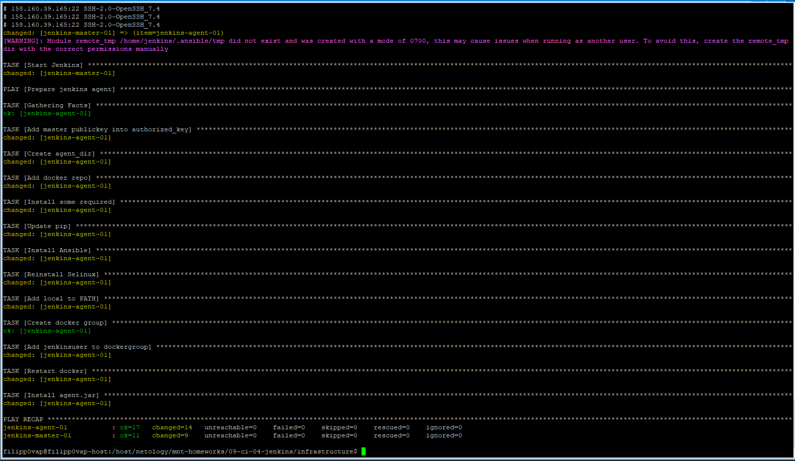
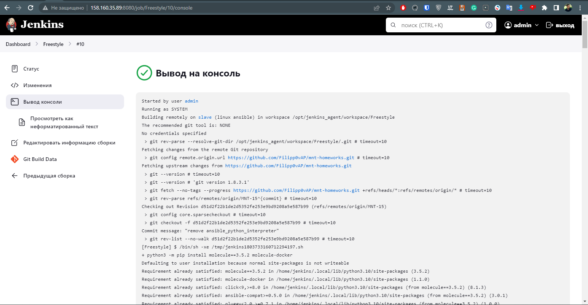
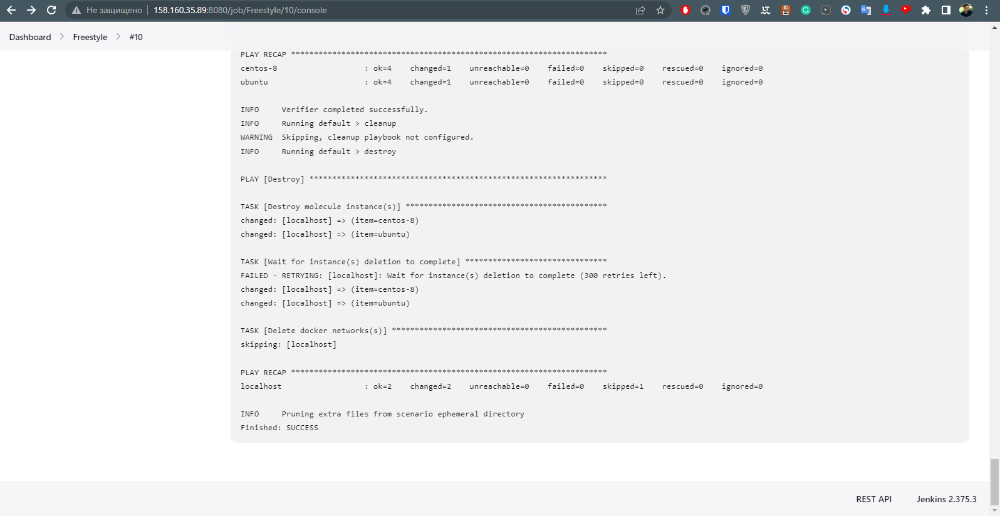
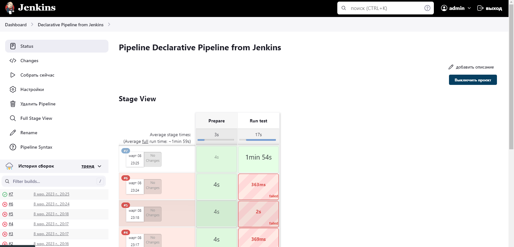
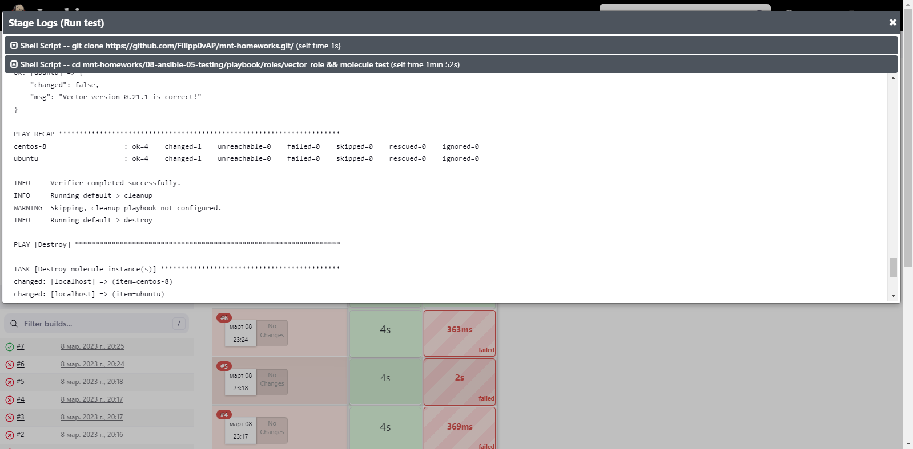
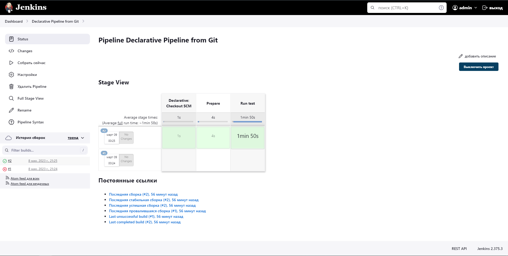
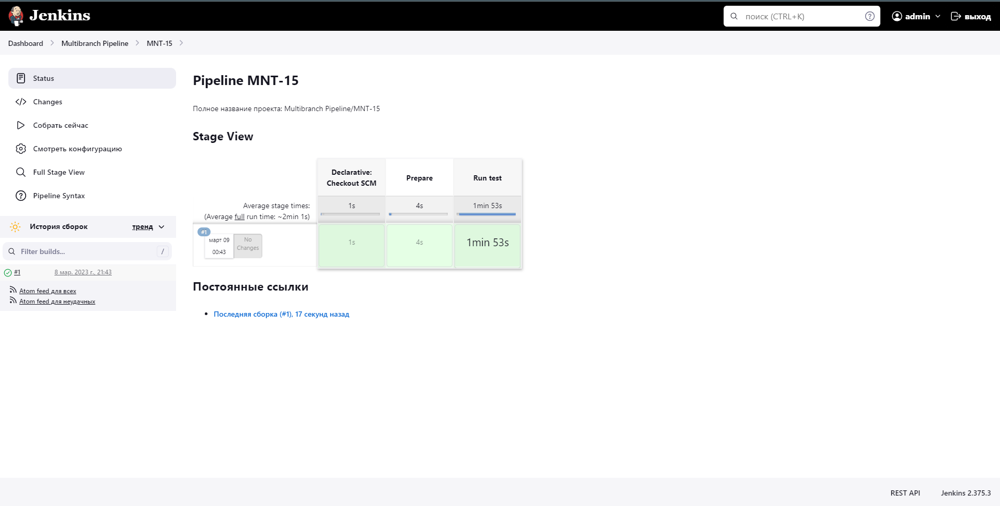
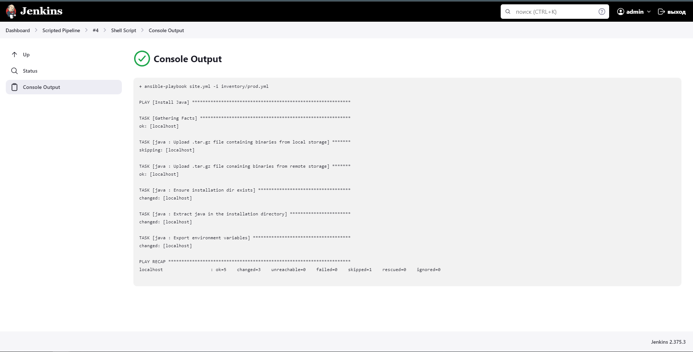

# Домашнее задание к занятию "09.04 Jenkins"

## Подготовка к выполнению

1. Создать 2 VM: для jenkins-master и jenkins-agent.
2. Установить jenkins при помощи playbook'a.
3. Запустить и проверить работоспособность.
4. Сделать первоначальную настройку.

## Основная часть

1. Сделать Freestyle Job, который будет запускать `molecule test` из любого вашего репозитория с ролью.
2. Сделать Declarative Pipeline Job, который будет запускать `molecule test` из любого вашего репозитория с ролью.
3. Перенести Declarative Pipeline в репозиторий в файл `Jenkinsfile`.
4. Создать Multibranch Pipeline на запуск `Jenkinsfile` из репозитория.
5. Создать Scripted Pipeline, наполнить его скриптом из [pipeline](./pipeline).
6. Внести необходимые изменения, чтобы Pipeline запускал `ansible-playbook` без флагов `--check --diff`, если не установлен параметр при запуске джобы (prod_run = True), по умолчанию параметр имеет значение False и запускает прогон с флагами `--check --diff`.
7. Проверить работоспособность, исправить ошибки, исправленный Pipeline вложить в репозиторий в файл `ScriptedJenkinsfile`.
8. Отправить ссылку на репозиторий с ролью и Declarative Pipeline и Scripted Pipeline.

## Ответы

0. Создал машины и установил jenkins при помощи playbook'a.

1. Сделал Freestyle Job, который запускает `molecule test` из предыдущего задания 08-ansible-04-role 
`(на этом моменте был некоторый пердолинг из-за того что молекула не работала с Python 3.6, а через yum нельзя поставить python 3.10 и пришлось собирать его из исходников, и когда я это делал она его не использовала. Но в итоге через несколько часов я заставил все работать 🎉🥳)`

2. Сделал Declarative Pipeline Job, который делает тоже самое

3. Перенес пайплайн в гит и проверил работу

4. Создал Multibranch Pipeline на запуск `Jenkinsfile` из репозитория.

5. Создал Scripted Pipeline, наполнил его скриптом из [pipeline](./pipeline). 
Сделал выбор значения prod_run, сделал форк репозитория, прописал его в [скрипт](./pipeline/Jenkinsfile) и добился выполнения джобы с успешным завершением плейбука

## Необязательная часть

1. Создать скрипт на groovy, который будет собирать все Job, которые завершились хотя бы раз неуспешно. Добавить скрипт в репозиторий с решением с названием `AllJobFailure.groovy`.
2. Создать Scripted Pipeline таким образом, чтобы он мог сначала запустить через Ya.Cloud CLI необходимое количество инстансов, прописать их в инвентори плейбука и после этого запускать плейбук. Тем самым, мы должны по нажатию кнопки получить готовую к использованию систему.

---

### Как оформить ДЗ?

Выполненное домашнее задание пришлите ссылкой на .md-файл в вашем репозитории.

---
